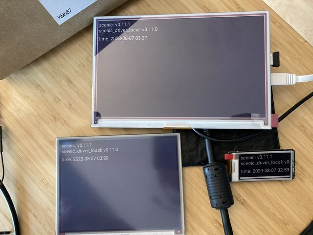

# InkyTester

Minimal Nerves + Scenic project to test:
- https://github.com/pappersverk/inky
- https://github.com/pappersverk/scenic_driver_inky

See also: https://github.com/pappersverk/sample_scenic_inky

## Getting Started

To start your Nerves app:
  * `export MIX_TARGET=my_target` or prefix every command with
    `MIX_TARGET=my_target`. For example, `MIX_TARGET=rpi3`
  * Install dependencies with `mix deps.get`
  * Create firmware with `mix firmware`
  * Burn to an SD card with `mix burn`
